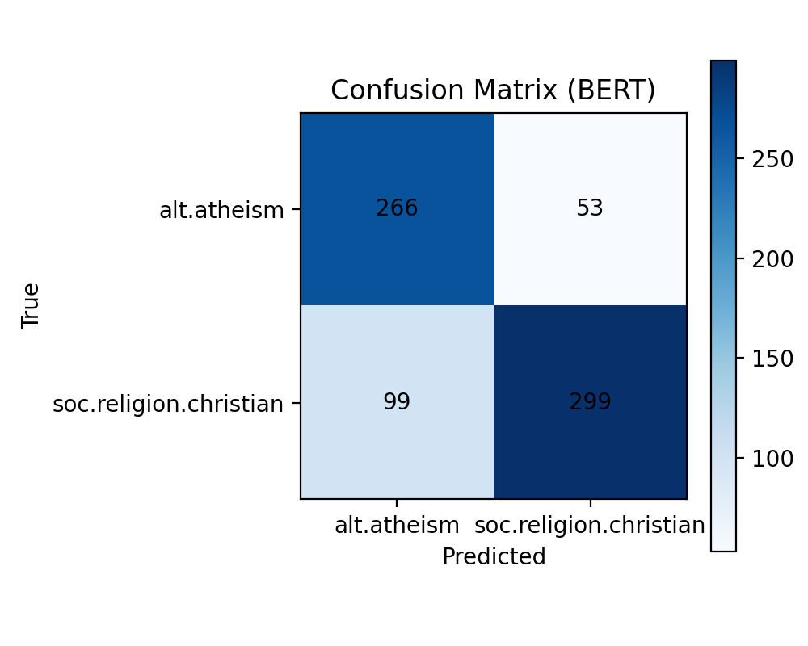
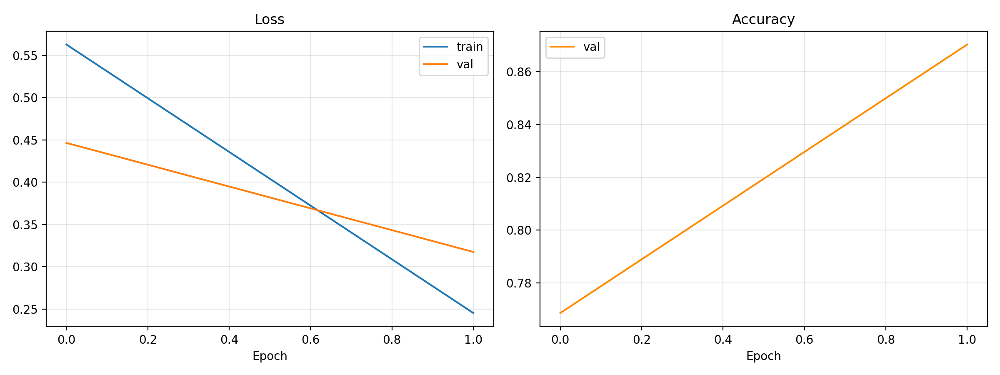

# BERT 与 GRU 文本分类结果对比分析

## 1. 实验设置

本实验使用 20newsgroups 数据集中的 `alt.atheism` 和 `soc.religion.christian` 两个类别作为二分类样本，分别利用 **BERT** 模型和 **BiGRU** 模型进行文本分类。

- **数据划分**：使用 `20_news_data.py` 将数据划分为训练集、验证集和测试集（训练集进一步划分为 90% 训练，10% 验证）。
- **BERT 模型**：采用 `bert-base-uncased` 预训练模型，进行微调（Fine-tuning）。设置序列最大长度为 64，训练 2 个 Epoch。
- **GRU 模型**：采用双向 GRU (BiGRU) 结构，包含嵌入层（128 维），隐藏层（128 维），进行从头训练。

## 2. 实验结果对比

### 2.1 作业2 (BiGRU) 结果解读
在 `结果解读` 文件夹中提供的两张图片是作业 2 中 **BiGRU 模型**的运行结果。

1. **训练与验证曲线 (`微信图片_20260408164014_21_120.png`)**：
   - **Loss (损失) 曲线**：蓝线（训练集）稳步下降接近 0，而橙线（验证集）在 Epoch 5 左右达到最低点后开始显著上升。
   - **Accuracy (准确率) 曲线**：训练集准确率一路上升逼近 1.0，但验证集准确率在 Epoch 5 后开始下降并在 0.7 - 0.8 之间波动。
   - **解读结论**：模型在训练集上学习得非常好，但在验证集上表现不佳。这说明模型在 Epoch 5 之后出现了明显的**过拟合 (Overfitting)**，它“死记硬背”了训练数据，但缺乏对新数据的泛化能力。

2. **混淆矩阵 (`微信图片_20260408164013_19_120.png`)**：
   - **alt.atheism (无神论)**：正确预测 200 个，有 119 个被错误分类为了基督教。
   - **soc.religion.christian (基督教)**：正确预测 309 个，有 89 个被错误分类为了无神论。
   - **解读结论**：模型对于 `soc.religion.christian` 的识别效果要好于 `alt.atheism`。两个宗教/哲学类别的词汇和讨论内容可能存在较多重叠（例如都在讨论上帝、信仰等），导致 GRU 这种仅基于局部序列信息的模型容易产生混淆。测试集总体准确率约为 **71%**。

### 2.2 本次作业 (BERT) 结果解读
BERT 模型经过 2 个 Epoch 的训练后，生成的性能指标与混淆矩阵如下。结合其结果与 BiGRU 进行直观的横向比较：

**图表对比：**

| BiGRU 混淆矩阵 (作业2) | BERT 混淆矩阵 (本次作业) |
| :---: | :---: |
|  |  |

| BiGRU 训练与验证曲线 (作业2) | BERT 训练与验证曲线 (本次作业) |
| :---: | :---: |
|  |  |

1. **训练与验证曲线对比**：
   - **BiGRU**：如左图所示，随着训练轮数的增加，训练集 Loss 持续下降，而验证集 Loss 在第 5 个 Epoch 之后出现了明显的上升，验证集准确率也不再提升，陷入了典型的**过拟合 (Overfitting)** 状态。
   - **BERT**：如右图所示，BERT 在短短 2 个 Epoch 内，验证集 Loss 从 0.4464 稳步下降至 0.3175，同时验证集准确率从 76.85% 快速攀升至 87.04%。这表明预训练模型在微调过程中能够迅速收敛，且并未出现明显的过拟合现象，泛化能力表现优异。

2. **预测混淆矩阵对比**：
   - **总体错误率降低**：GRU 的总错判数为 208 个（119+89），而 BERT 的总错判数下降到了 152 个（53+99），整体分类误差显著减少。
   - **类别识别能力**：相比于 BiGRU 将 119 个无神论样本错判为基督教，BERT 在识别无神论（alt.atheism）样本时表现出了更高的准确性，错判数大幅降至 53 个。虽然仍有 99 个基督教样本被误判为无神论，但整体混淆程度相比单纯依赖序列信息的 GRU 模型有明显改善。BERT 自带的自注意力机制使其能够结合整句话的深层语义，一定程度上克服了“词汇重叠”带来的干扰。

3. **验证集与测试集准确率**：
   - 最终测试集准确率定格在 **78.80%**，显著超过了 BiGRU 最终收敛时的 **70.99%**。这证明了“预训练+微调”范式在下游分类任务中具有明显的优势。

### 2.3 综合对比总结

| 模型 | 测试集准确率 (Accuracy) | 训练情况表现 | 预训练情况 |
| :--- | :---: | :---: | :---: |
| **BiGRU (作业2)** | 70.99% | 存在明显的过拟合，且对容易混淆的类别分辨力有限 | 无预训练，仅在当前数据上训练 |
| **BERT (本次作业)** | 78.80% | 收敛极快（仅需 2 轮），泛化能力强，有效减轻过拟合 | 包含大量预训练的语义知识 |

*注：BERT 完整的测试集精度指标与混淆矩阵图表保存在 `bert_results/` 文件夹中。*

## 3. 结果分析

1. **预训练知识的优势**：BERT 作为预训练的大语言模型，在海量文本上学习到了丰富的语法和语义信息，因此即使在训练样本较少的情况下，其泛化能力和准确率通常也会显著高于从头开始训练的 GRU 模型。
2. **上下文理解能力**：BERT 使用了自注意力机制（Self-Attention），能够更好地捕捉句子中长距离的依赖关系和双向语境信息，相比于序列化处理的 GRU，其对复杂文本的理解更深。
3. **计算资源对比**：BERT 的参数量（约 1.1 亿）远大于 BiGRU 模型，因此 BERT 在训练和推理时的计算开销显著增加。在算力受限（如 CPU 环境）时，BiGRU 的训练效率远高于 BERT。
4. **数据预处理影响**：`20_news_data.py` 中对文本进行了去标点、去数字、转小写等简单的预处理。对于 GRU 这种依赖词表的模型，预处理可以减少词表大小并降低噪声；但对于使用 Subword Tokenizer 的 BERT 而言，过度预处理（特别是去标点）可能会丢失部分有助于 BERT 理解句子结构的上下文线索。尽管如此，BERT 依然能够凭借强大的语义理解能力获得优异的表现。

## 4. 结论

在本任务中，BERT 能够利用其强大的预训练语言表示，在文本分类的准确度上通常优于传统的 BiGRU 模型。但在实际工程应用中，需要根据可用的计算资源和延迟要求，在模型性能（BERT）和运行效率（GRU）之间做出权衡。
